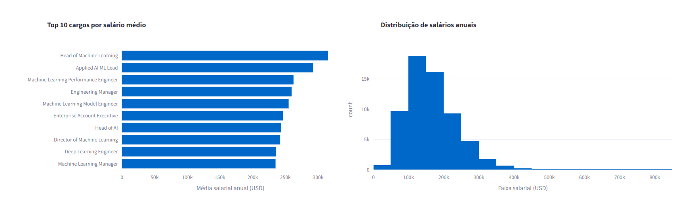
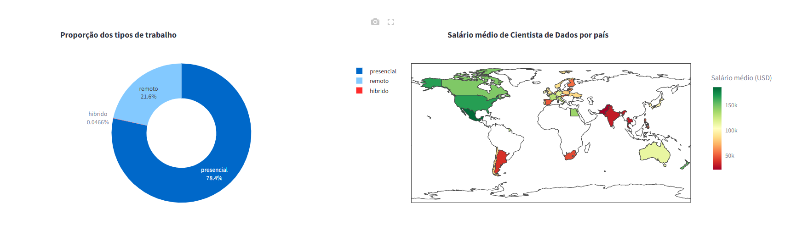

### 🎲 Dashboard de Análise de Salários na Área de Dados

LINK

Este projeto faz parte da Imersão Dados com Python II, o objetivo é construir um Dashboard interativo com Streamlit, uma biblioteca Python que simplifica a criação de aplicações web voltadas para ciência de dados. O dashboard desenvolvido permite:

- Carregar e explorar dados salariais da área de tecnologia e dados.
- Aplicar filtros dinâmicos (ano, senioridade, tipo de contrato, tamanho da empresa).
- Gerar métricas principais (KPIs) como salário médio, salário máximo, cargo mais frequente e número total de registros.
- Visualizar gráficos interativos com auxílio da biblioteca Plotly.
- Exibir uma tabela detalhada dos dados filtrados para análise mais granular.

Além da construção local, o projeto também aborda o deploy na plataforma Streamlit Cloud, permitindo que o dashboard seja acessado online e compartilhado com outras pessoas.

## ⚙️ Configuração do Ambiente (Código)

1. Criar o ambiente virtual:
```
python3 -m venv .venv
```
2. Ativar o ambiente virtual em Windows:
```
.venv\Scripts\Activate
```
3. Ativar o ambiente virtual em MAC/LINUX:
```
source .venv/bin/activate
```
4. Criar um arquivo chamado requirements.txt e adicionar os pacotes necessários
```
pandas==2.2.3
streamlit==1.44.1
plotly==5.24.1
```
5. Instalar as bibliotecas necessárias
```
pip install -r requirements.txt
```

---


